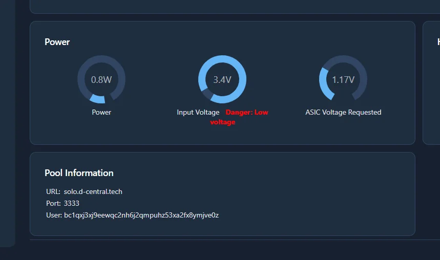
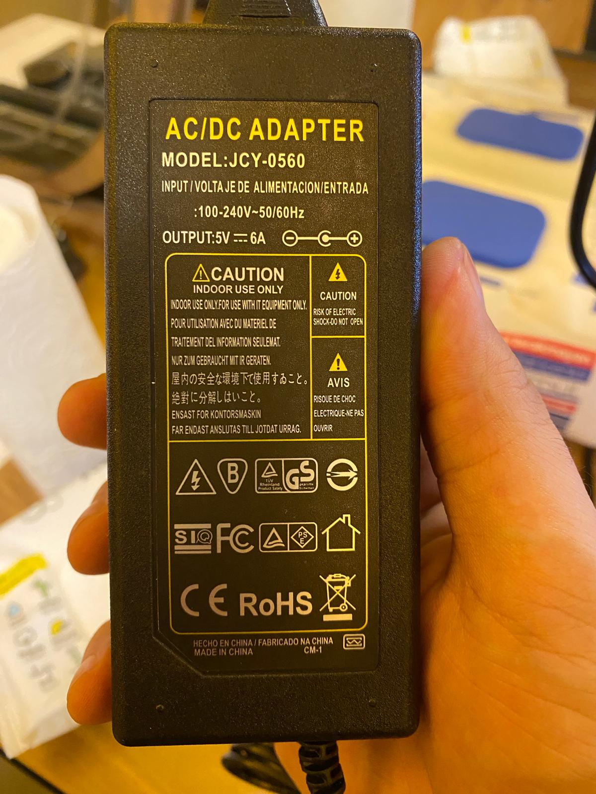
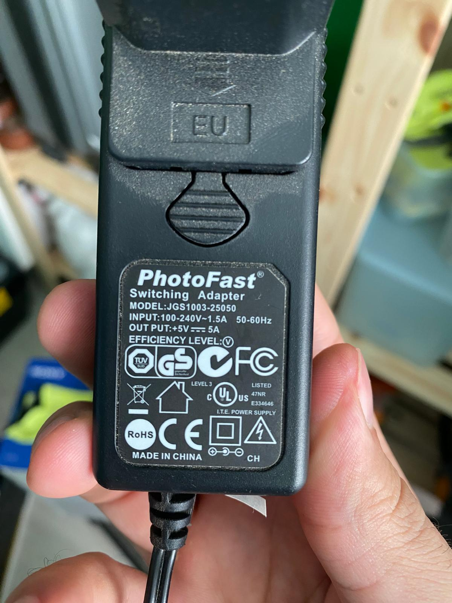
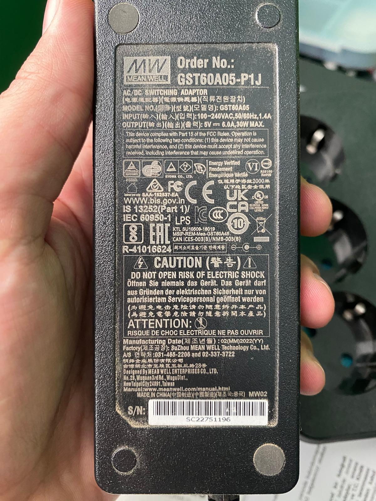
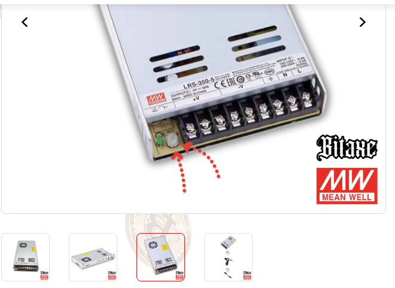

# 1. Low Voltage (Düşük Voltaj) Hatası

*Bitaxe Low Voltage (Düşük Voltaj) Hatası*

Bitaxe'larda en sık görünen hata low voltage (düşük voltaj) hatasıdır. Bu hata alındığında Bitaxe genellikle hash üretmez veya çok düşük bir hash üretir.

Bunun durumun çeşitli sebepleri bulunabilir.

### Kötü Güç Kaynağı (PSU veya adaptör de denir.)

Bir Bitaxe için gerilim değeri 5 volt, akım değeri minimum 4-5 amper güç kaynağı gerekir. Gerilim tam 5 volt olmak zorundadır, ancak akım dediğimiz amper gücü daha yüksek olabilir. Teoride bir güç kaynağının sağlayabildiği akım (amper) ne kadar yüksekse o kadar iyi sayılabilir.

Bazı güç kaynakları Bitaxe'ı neredeyse hiç çalıştırmamaktadır.

*Bitaxe Çalıştırmayan Adaptör Örneği*

Bazı güç kaynakları belli bir süre sonra bozulmaktadır.

*Bu güç kaynağı bir ay çalıştırdı, sonrasında bozuldu.*

Bazı güç kaynakları da hiç bir sorun oluşturmadan çalışmaktadır. Genel olarak Bitaxe için en iyi güç kaynağı markası olan MeanWell kullanılmasını öneriyoruz.

*MeanWell Güç Kaynağı*

Bitaxe'da Low Voltage (Düşük Voltaj) hatası görürseniz ilk denemeniz gereken çözüm farklı bir güç kaynağı ile denemektir.

### Düşük Güç Kaynağı Ayarı

Eğer enclosed denilen, harici bir güç kaynağı kullanıyorsanız, akım gücü ayarı düşük kalmış olabilir. Akım gücü ayarını maksimum ayarına getirmeniz gerekmektedir.

*Harici Güç Kaynağı Akım Ayarı*

# 2. Belli bir süre sonra hash vermemesi

Bu durumla karşılaşırsanız aşağıdaki adımları uygulamanızı tavsiye ediyoruz.

1. axeOS arayüzünde hem voltajı hem frekansı minimuma getirin.
2. Cihazı çalıştırın, 1 gün boyunca dokunmayın.
3. Cihaz hash vermeyi keserse voltajı bir adım arttırın.
4. Cihaz 1 gün boyunca stabil çalışıncaya kadar voltajı adım adım arttırmaya devam edin.
5. Cihazın doğru voltajını bulduğunuzu düşünüyorsanız frekansı adım adım arttırmaya başlayabilirsiniz.
6. Bir sorun çıkarsa bir önceki frekansa geri dönün ve cihazı o ayarlarda sorunsuzca çalıştırmaya devam edin.
